# FinFund · Thaiscreener

> ระบบวิเคราะห์และคัดกรอง **กองทุนรวมไทย** แบบครบวงจร: เว็บ (React) + เซิร์ฟเวอร์ (Go) + ฐานข้อมูล (MySQL) + ตัวดึงข้อมูลเบื้องหลัง + แจ้งเตือนสัญญาณผ่าน Discord

🌐 **เว็บไซต์:** [thaiscreener.com](https://thaiscreener.com) · 📧 **ติดต่อ/แจ้งปัญหา:** [contact@thaiscreener.com](mailto:contact@thaiscreener.com)

> ⚠️ ข้อมูลทั้งหมดใช้ประกอบการศึกษาเท่านั้น **ไม่ใช่คำแนะนำการลงทุน** (ดูหัวข้อ [8. คำแนะนำและคำเตือน](#8-คำแนะนำและคำเตือน))

---

## สารบัญ

1. [อธิบายโครงสร้าง](#1-อธิบายโครงสร้าง)
2. [การทำงาน](#2-การทำงาน)
3. [คุณสมบัติ](#3-คุณสมบัติ)
4. [สถาปัตยกรรมและเทคโนโลยีที่ใช้](#4-สถาปัตยกรรมและเทคโนโลยีที่ใช้)
5. [ทำอะไรได้บ้าง (ฟีเจอร์ตามหน้าจอ + API)](#5-ทำอะไรได้บ้าง)
6. [ผลลัพธ์ที่ผู้ใช้ได้รับ](#6-ผลลัพธ์ที่ผู้ใช้ได้รับ)
7. [แหล่งข้อมูล](#7-แหล่งข้อมูล)
8. [คำแนะนำและคำเตือน](#8-คำแนะนำและคำเตือน)
9. [การติดตั้ง รัน และ Deploy](#9-การติดตั้ง-รัน-และ-deploy)
10. [งานเบื้องหลังและการตั้งเวลา (cron)](#10-งานเบื้องหลังและการตั้งเวลา-cron)
11. [สรุปสัญญาณรายวันทาง Discord](#11-สรุปสัญญาณรายวันทาง-discord)
12. [บัญชีแอดมินและรหัสผ่าน](#12-บัญชีแอดมินและรหัสผ่าน)
13. [การพัฒนา ทดสอบ และ CI/CD](#13-การพัฒนา-ทดสอบ-และ-cicd)
14. [เอกสารอื่นในโปรเจกต์](#14-เอกสารอื่นในโปรเจกต์)
15. [ติดต่อเรา](#15-ติดต่อเรา)

---

## 1. อธิบายโครงสร้าง

### 1.1 ภาพรวมระบบ

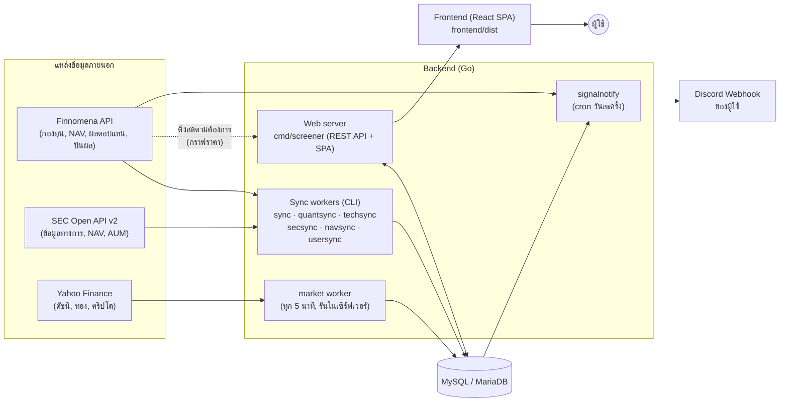

หลักคิดสำคัญ: **ข้อมูลส่วนใหญ่ถูกดึงมาเก็บใน MySQL ล่วงหน้าด้วย worker** แล้วเว็บอ่านจากฐานข้อมูลของเราเอง ทำให้เร็วและไม่กดดันต้นทาง ข้อยกเว้นคือกราฟ/ราคาย้อนหลังรายกองทุน (`/api/fund/nav` ที่หน้ากองทุน, Analysis และ Mining) ซึ่งเซิร์ฟเวอร์ดึงสดจาก Finnomena ทุกครั้งที่เรียก (ยังไม่มีแคชชั้นนี้ในโค้ด) จึงควรระวังปริมาณการเรียก

### 1.2 โครงสร้างโฟลเดอร์

```text
finfund/
├── client.go, fee_translation.go   # Finnomena API client (retry + backoff) และแปลค่าธรรมเนียมไทย→อังกฤษ
├── models/                         # struct ที่ตรงกับ JSON ของ Finnomena + โมเดลผู้ใช้/ควอนต์
├── screener/                       # แกนคัดกรอง: Filter 18+ ชนิด, Sort, Cache (TTL) — Go มาตรฐาน ไม่พึ่งไลบรารีนอก
├── cmd/
│   ├── screener/                   # ★ เว็บเซิร์ฟเวอร์หลัก (REST API + เสิร์ฟ frontend/dist + sitemap + SEO)
│   ├── sync/                       # ดึงรายชื่อกองทุน ผลตอบแทน ปันผล จาก Finnomena
│   ├── quantsync/                  # คำนวณ Quant Score (CAGR, Max DD, Volatility, Sharpe, Win rate)
│   ├── techsync/                   # คำนวณ MACD / RSI / EMA50 / EMA200 เก็บลง DB
│   ├── secsync/                    # ดึงทะเบียนกองทุนจาก SEC API v2
│   ├── navsync/                    # ดึง NAV และสินทรัพย์รวม (AUM) รายวันจาก SEC
│   ├── usersync/                   # ลดวันคงเหลือของสมาชิก / ปรับ Premium หมดอายุ → Free
│   ├── signalnotify/               # ส่งสรุปสัญญาณเข้า Discord ของผู้ใช้
│   ├── adminpw/                    # ตั้ง/สุ่มรหัสผ่านผู้ใช้ (ใช้กับแอดมิน)
│   ├── migrate_divs/               # สคริปต์ย้ายข้อมูลปันผลครั้งเดียว
│   └── debug_sec/                  # เครื่องมือ debug SEC API
├── internal/
│   ├── api/                        # HTTP handler: auth, admin, discord, watchlist, AUM, SEC info, presence
│   ├── middleware/                 # JWT (RequireAuth / RequireAdmin)
│   ├── ratelimit/, (api/auth_limit) # จำกัดอัตรา login / register
│   ├── store/                      # ชั้นฐานข้อมูล MySQL ทั้งหมด (+ InitSchema สร้างตารางอัตโนมัติ)
│   ├── secapi/                     # client ของ SEC Open API v2 (อ่านคีย์จาก system_settings)
│   ├── signals/                    # ตรรกะ "ป้ายสัญญาณ" (MACD/TRIX/SMA/RSI → ซื้อ/ถือ/ขาย)
│   ├── signalnotify/               # วงจรส่งสรุป Discord + จำป้ายที่แจ้งไปล่าสุด
│   ├── notify/discord/             # สร้างข้อความ embed และส่ง webhook
│   ├── indicators/                 # ฟังก์ชัน MACD, RSI, EMA
│   └── market/                     # worker ดึงราคาจาก Yahoo Finance ทุก 5 นาที
├── frontend/                       # React 19 + Vite + Tailwind (build ออกที่ frontend/dist)
├── scripts/webhook/                # ตัวรับ webhook สำหรับ deploy (ทางเลือกเสริม)
├── configs/config.example.yaml     # ตัวอย่างค่าตั้ง
├── docs/                           # เอกสารเสริม (API, CI, แผน, SEC API, NOTES)
├── .github/workflows/              # test.yml + deploy.yml (CI/CD)
└── Makefile                        # build ทุกโปรแกรมลง bin/
```

### 1.3 ตารางหลักในฐานข้อมูล

ตารางทั้งหมดสร้างอัตโนมัติด้วย `InitSchema()` ทุกครั้งที่เซิร์ฟเวอร์เริ่ม (`internal/store/mysql.go`)

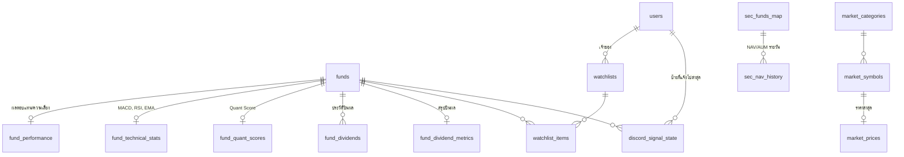

| ตาราง | เก็บอะไร |
|---|---|
| `funds`, `fund_performance` | รายชื่อกองทุน (รหัส, ชื่อ, บลจ., ประเภท RMF/SSF/ThaiESG) และผลตอบแทนหลายช่วงเวลา / Sharpe / Max Drawdown / ขนาดกองทุน |
| `fund_quant_scores` | คะแนนควอนต์ที่ `quantsync` คำนวณ |
| `fund_technical_stats` | ค่า MACD, Signal, RSI, EMA50, EMA200 ล่าสุด |
| `fund_dividends`, `fund_dividend_metrics` | ประวัติปันผล วัน XD และ yield ที่คำนวณแล้ว |
| `sec_funds_map`, `sec_nav_history` | ทะเบียนกองทุนจาก ก.ล.ต. และ NAV/สินทรัพย์รวมรายวัน |
| `market_categories`, `market_symbols`, `market_prices` | หมวด/สัญลักษณ์/ราคาตลาด (ดัชนี ทอง คริปโต) |
| `watchlists`, `watchlist_items`, `user_watchlists` | รายการเฝ้าดู (สาธารณะของระบบ + ส่วนตัวของผู้ใช้) |
| `users`, `system_settings` | บัญชีผู้ใช้ (role/tier/วันคงเหลือ) และค่าตั้งระบบ (วัน Free เริ่มต้น, คีย์ SEC) |
| `discord_signal_state` | ป้ายสัญญาณที่แจ้งไปล่าสุดต่อผู้ใช้ต่อกองทุน |

---

## 2. การทำงาน

### 2.1 เส้นทางของข้อมูล (Data Pipeline)

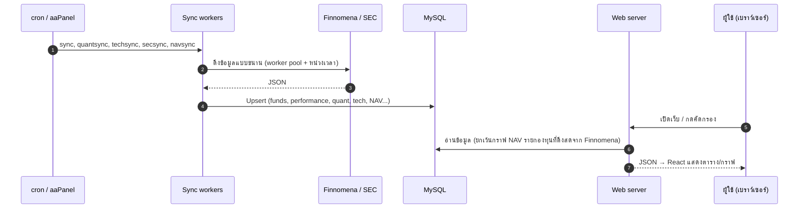

### 2.2 การคัดกรองกองทุน (Screener)

`GET /api/screener` รับพารามิเตอร์ → สร้างชุด `Filter` → กรอง → จัดเรียง → แคชผลลัพธ์แบบ TTL ในหน่วยความจำ

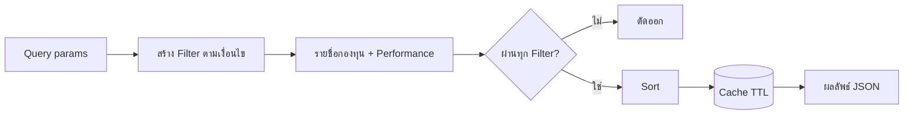

Filter ที่มี (`screener/filter.go`): ผลตอบแทนรายช่วง (1W–5Y) และรายปี, Sharpe, Drawdown, ส่วนเบี่ยงเบนมาตรฐาน, ขนาดกองทุน (Net Assets), NAV, % เปลี่ยนแปลงรายวัน, หมวดหมู่ / ชื่อหมวด, Finno Score, PP, RR, ค่าธรรมเนียม, สถานะกองทุน, แนวโน้ม (Trending), ความพร้อมของข้อมูล (PerformanceReady) และปันผล

### 2.3 Quant Score (จัดอันดับ)

`quantsync` ดึงราคาย้อนหลังของแต่ละกองทุนจาก Finnomena แล้วคำนวณ:

| ตัวชี้วัด | ความหมาย |
|---|---|
| CAGR | ผลตอบแทนเฉลี่ยต่อปีแบบทบต้น |
| Max Drawdown | การลดลงสูงสุดจากจุดสูงสุด |
| Volatility | ความผันผวนรายปี (ส่วนเบี่ยงเบนมาตรฐานรายวัน × √252) |
| Sharpe | CAGR ÷ Volatility (ในโค้ดไม่หักอัตราดอกเบี้ยปลอดความเสี่ยง) |
| Win Rate | สัดส่วนเดือนที่ราคาปิดเพิ่มขึ้น |

คะแนนรวม (`score`) = Sharpe (>1.0 ได้ 4, >0.5 ได้ 2) + Max Drawdown (ดีกว่า −10% ได้ 3, ดีกว่า −25% ได้ 1) + Win Rate (>60% ได้ 3, ≥45% ได้ 1) → เต็ม 10 คะแนน แล้วหน้า **Ranking** แสดง Quant Top 100

### 2.4 ป้ายสัญญาณ (Signals)

ใช้ทั้งหน้ารายการเฝ้าดูและข้อความ Discord (ตรรกะอยู่ที่ `internal/signals/`) แต่ละตัวชี้วัดให้คะแนนโมเมนตัม แล้วเฉลี่ย:

| สถานะโมเมนตัม (MACD / TRIX / SMA) | คะแนน |
|---|---|
| ทะยานขึ้น (ค่า > เส้นสัญญาณ และกำลังเพิ่ม) | +2 |
| กำลังฟื้นตัว (ค่า ≤ เส้นสัญญาณ แต่กำลังเพิ่ม) | +1 |
| ระวังย่อตัว (ค่า > เส้นสัญญาณ แต่กำลังลด) | −1 |
| ดิ่งลง (ค่า ≤ เส้นสัญญาณ และกำลังลด) | −2 |

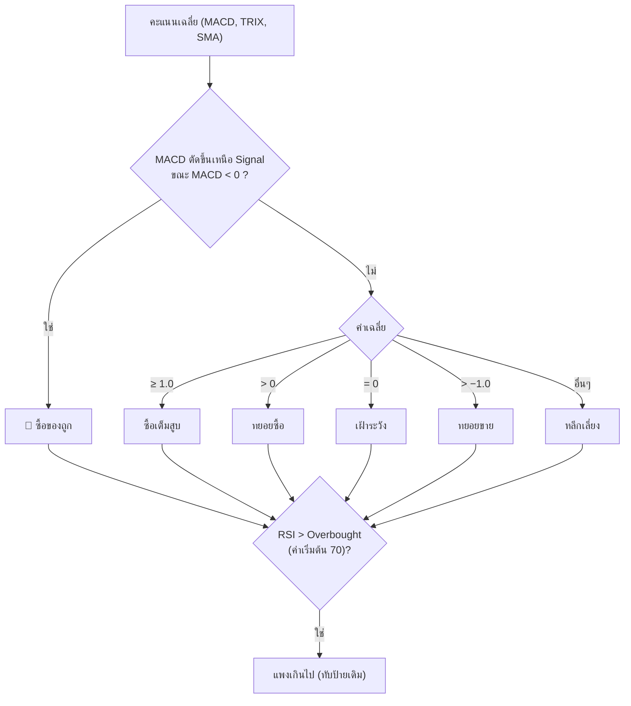

ถ้าไม่มีข้อมูลตัวชี้วัดเลย ป้ายจะเป็น "ถือ" / "รอข้อมูล" ค่าเริ่มต้นของพารามิเตอร์: MACD (19, 39, 9), TRIX (50, 9), RSI (14; Overbought 70 / Oversold 30), SMA (50, 200) ปรับได้ผ่านไฟล์ `settings.json` ที่รากโปรเจกต์ (ไฟล์นี้ไม่ถูก commit — อยู่ใน `.gitignore`; ถ้าไม่มีจะใช้ค่าเริ่มต้น)

### 2.5 การยืนยันตัวตน

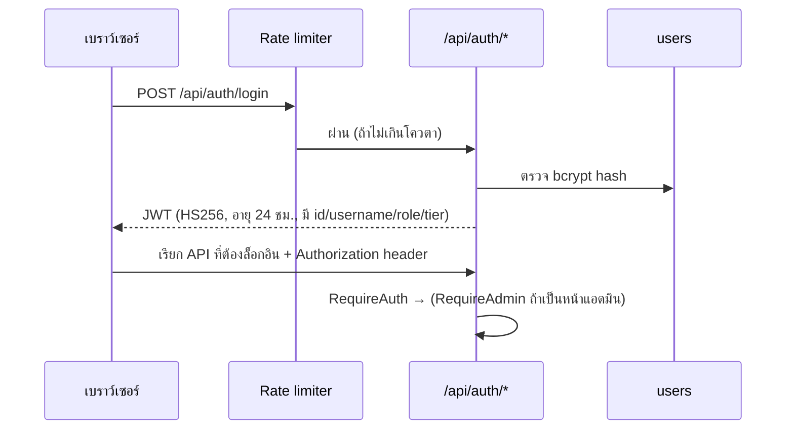

---

## 3. คุณสมบัติ

**ด้านข้อมูลและการวิเคราะห์**
- คัดกรองกองทุนด้วยเงื่อนไข 18+ ชนิด (ผลตอบแทน ความเสี่ยง ขนาด หมวดหมู่ ค่าธรรมเนียม สถานะ ปันผล ฯลฯ)
- จัดอันดับ Quant Top 100 ด้วยเมตริกย้อนหลัง (CAGR / Max Drawdown / Sharpe / Win Rate)
- สัญญาณทางเทคนิค: MACD, TRIX, SMA, RSI, EMA → ป้ายแนะนำเชิงสถิติ
- ภาพรวมตลาด: อารมณ์ตลาด (sentiment), market breadth, Heatmap ตามหมวด, Movers, ผลตอบแทน–ความเสี่ยง (scatter), ผลตอบแทนปันผล (yield), ขนาดกองทุน
- วิเคราะห์ปันผล: ประวัติ วัน XD และ yield
- เปรียบเทียบกองทุนหลายตัวบนกราฟเดียว (Analysis) พร้อมแท็บ AUM / สินทรัพย์รวมจาก ก.ล.ต.
- หากองทุนที่ **เคลื่อนไหวสวนทาง** (Inverse Correlation) เพื่อกระจายความเสี่ยง
- ตลาดของถูก (Cheap Market) กองทุนที่ราคาปรับตัวลงลึก
- หน้ากองทุนรายตัว `/fund/:symbol` พร้อม SEO (title/description/OG image/sitemap)

**ด้านผู้ใช้**
- สมัคร/ล็อกอิน (JWT), เปลี่ยนรหัสผ่านเองได้
- รายการเฝ้าดู (Watchlist) ส่วนตัว + รายการสาธารณะของระบบ
- แจ้งเตือนสัญญาณรายวันผ่าน Discord (สรุปเต็ม หรือเฉพาะป้ายที่เปลี่ยน) และปุ่ม "ส่งสรุปตอนนี้"
- ระดับสมาชิก `free` / `premium` พร้อมระบบนับวันคงเหลือ (แอดมินกำหนดได้)

**ด้านระบบ**
- ดึงข้อมูลแบบขนาน (worker pool) + retry แบบ exponential backoff (1s, 2s, 4s)
- แคชในหน่วยความจำแบบ TTL, แคชความสัมพันธ์ (correlation cache)
- ตั้งค่า Security header ทุก response (`nosniff`, `X-Frame-Options`, `Referrer-Policy`, `Permissions-Policy`)
- จำกัดอัตรา login / สมัครสมาชิก (ดูข้อ 8)
- Deploy อัตโนมัติด้วย GitHub Actions เมื่อ push เข้า `main`

---

## 4. สถาปัตยกรรมและเทคโนโลยีที่ใช้

### 4.1 รูปแบบสถาปัตยกรรม

**Modular monolith + batch workers** — เซิร์ฟเวอร์ Go ตัวเดียวทำทั้ง REST API และเสิร์ฟ SPA ส่วนงานหนัก/ตามเวลาแยกเป็นโปรแกรม CLI เล็กๆ ที่ใช้ชั้น `store` เดียวกัน

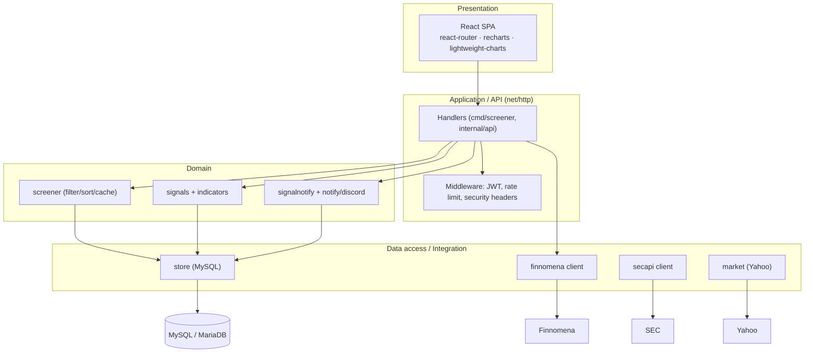

### 4.2 เทคโนโลยี

| ชั้น | เทคโนโลยี |
|---|---|
| ภาษา Backend | Go 1.26 (ตาม `go.mod`), **pure Go ไม่ใช้ CGO**, ใช้ `net/http` มาตรฐาน |
| ไลบรารี Backend | `go-sql-driver/mysql`, `golang-jwt/jwt/v5`, `joho/godotenv`, `golang.org/x/crypto` (bcrypt) |
| ฐานข้อมูล | MySQL 5.7 / 8.0 / MariaDB 10.11 (ทดสอบบน CI ทั้ง 3 ตัว) |
| Frontend | React 19, TypeScript, Vite, Tailwind CSS 4, React Router 7, Recharts, lightweight-charts, framer-motion, lucide-react |
| Lint / ตรวจโค้ด | golangci-lint, staticcheck, gofumpt (Go); oxlint + `tsc` (Frontend) |
| Process manager | PM2 (บน aaPanel) |
| CI/CD | GitHub Actions → SSH เข้า VPS → build → restart PM2 |

### 4.3 การออกแบบที่ควรรู้

- **Frontend ถูก build แล้ว commit ลง git** (`frontend/dist`) เซิร์ฟเวอร์จึงไม่ต้องมี Node ตอน deploy
- **Schema อัตโนมัติ**: ไม่มีไฟล์ migration แยก — `InitSchema()` สร้าง/เพิ่มคอลัมน์ให้เองตอนเริ่มเซิร์ฟเวอร์ (การย้ายข้อมูลครั้งเดียวต้องทำเป็นคำสั่งแยก เช่น `migrate_divs`)
- **เซิร์ฟเวอร์ทำงานได้แม้ไม่มี DB** (`DB_DSN` ว่าง) แต่ API ที่ต้องใช้ฐานข้อมูลจะตอบ `Database not available`
- **SEO**: เซิร์ฟเวอร์ฉีด meta tag ต่อหน้ากองทุนและสร้าง `/sitemap.xml` จากข้อมูลใน DB

---

## 5. ทำอะไรได้บ้าง

### 5.1 หน้าจอ (Routes ของ Frontend)

| เส้นทาง | หน้า | ทำอะไรได้ |
|---|---|---|
| `/` | Dashboard | ภาพรวมตลาด อารมณ์ตลาด Heatmap Movers ticker ดัชนี/ทอง/คริปโต |
| `/screener` | คัดกรองกองทุน | ตั้งเงื่อนไขหลายชั้นแล้วดูผลทันที |
| `/ranking` | จัดอันดับ | Quant Top 100 และ Top 10 ตามหมวด/บลจ. |
| `/cheap-market` | ตลาดของถูก | กองทุนที่ราคาตกลงลึกและอยู่โซนถูก |
| `/dividend-analysis` | วิเคราะห์ปันผล | ประวัติปันผล วัน XD yield |
| `/analysis` | วิเคราะห์เปรียบเทียบ | กราฟ NAV หลายกองทุน, AUM, Inverse correlation |
| `/mining?symbol=รหัสกองทุน` | ค้นหาปัจจัย (Seasonality) | วิเคราะห์ฤดูกาลของกองทุนทีละตัว: YTD แยกตามปี, ตารางผลตอบแทนรายเดือน, Drawdown, Quant Score (รายละเอียดที่ข้อ 5.4) |
| `/fund/:symbol` | หน้ากองทุน | รายละเอียด กราฟ NAV ข้อมูล ก.ล.ต. ปันผล สัญญาณ |
| `/watchlist` | รายการเฝ้าดู | จัดการรายการ ดูป้ายสัญญาณ เปิดแจ้งเตือน Discord |
| `/profile` | ข้อมูลส่วนตัว | ตั้ง Discord webhook, โหมดการแจ้งเตือน, ส่งสรุปทันที, เปลี่ยนรหัสผ่าน |
| `/member`, `/admin-settings` | (แอดมิน) | จัดการผู้ใช้/สิทธิ์/Premium และค่าตั้งระบบ (วัน Free, คีย์ SEC) |
| `/login`, `/about`, `/privacy`, `/terms`, `/disclaimer` | ทั่วไป | เข้าสู่ระบบและหน้ากฎหมาย |

### 5.2 REST API (สรุป)

รูปแบบตอบกลับ: `{"success": true|false, "data": ..., "error": "..."}`

| กลุ่ม | Endpoint |
|---|---|
| คัดกรอง/จัดอันดับ | `GET /api/screener`, `/api/screener/technical`, `/api/screener/dividends`, `/api/screen/top1y`, `/api/fund/rankings` |
| ข้อมูลกองทุน | `/api/fund/info`, `/summary`, `/sec-info`, `/nav`, `/aum`, `/dividends`, `/ai-analysis`, `/inverse`, `/api/funds/search`, `/api/funds/amcs`, `/api/history/analysis` |
| ตลาด | `/api/dashboard`, `/api/market/ticker`, `/categories`, `/chart`, `/heatmap`, `/movers`, `/risk`, `/yield`, `/size` |
| ผู้ใช้ | `/api/auth/register`, `/login`, `/me`, `/change-password` |
| รายการเฝ้าดู | `/api/watchlists`, `/watchlists/toggle`, `/watchlists/funds`, `/watchlists/notify` |
| Discord | `/api/user/discord`, `/test`, `/mode`, `/digest-now` |
| แอดมิน (ต้อง admin) | `/api/admin/users`, `/api/admin/system-settings`, `/api/market/categories/create\|delete`, `/api/market/symbols/create\|delete` |
| อื่นๆ | `/api/settings`, `/api/presence`, `/sitemap.xml` |

รายละเอียดของ Finnomena API ที่ใช้อยู่ใน [docs/API.md](docs/API.md)

### 5.3 โปรแกรม CLI (build ลง `bin/`)

| โปรแกรม | หน้าที่ | ความถี่ที่แนะนำ |
|---|---|---|
| `screener` | เว็บเซิร์ฟเวอร์ (รันค้างด้วย PM2) | ตลอดเวลา |
| `sync` | รายชื่อกองทุน ผลตอบแทน ปันผล (5 worker) | รายวัน |
| `quantsync` | คำนวณ Quant Score | รายวัน/รายสัปดาห์ (หลัง `sync`) |
| `techsync` | MACD/RSI/EMA (ดึงราคา 2 ปี, หน่วง 500ms ต่อกองทุน) | รายวัน |
| `secsync` | ทะเบียนกองทุนจาก SEC | รายสัปดาห์ |
| `navsync` | NAV/AUM จาก SEC (ดึง 7 วันล่าสุดทุกรอบ; `--backfill` ย้อน 1 ปี) | รายวัน |
| `usersync` | ลดวันคงเหลือ, Premium หมดอายุ → Free | รายวัน |
| `signalnotify` | ส่งสรุป Discord (`-dry-run`, `-user`, `-disable-after`) | รายวัน (หลังข้อมูลอัปเดต) |
| `adminpw` | ตั้ง/สุ่มรหัสผ่านผู้ใช้ | ใช้เมื่อจำเป็น |
| `migrate_divs`, `debug_sec` | เครื่องมือครั้งเดียว/ดีบัก | ตามต้องการ |

### 5.4 หน้า "ค้นหาปัจจัย" (Seasonality / Mining) อย่างละเอียด

ไฟล์: [frontend/src/pages/Mining.tsx](frontend/src/pages/Mining.tsx) · เมนูชื่อ **ค้นหาปัจจัย** · เส้นทาง `/mining` (โหลดแบบ lazy)

**จุดประสงค์:** ตอบคำถามว่า "กองทุนนี้ในอดีต เดือนไหน/ช่วงไหนของปีมักขึ้นหรือลง และโดยรวมคุ้มความเสี่ยงหรือไม่" โดยดูกองทุน **ทีละตัว** (ไม่ใช่การเปรียบเทียบหลายกองทุน)

#### 5.4.1 วิธีใช้และการไหลของข้อมูล

1. พิมพ์ชื่อ/รหัสกองทุนในช่องค้นหา (`FundSearchBox`) แล้วเลือก — URL จะเปลี่ยนเป็น `/mining?symbol=รหัสตัวพิมพ์ใหญ่` จึงแชร์ลิงก์หรือรีเฟรชได้
2. หน้าเว็บเรียก API 2 ตัวพร้อมกัน แล้ว **คำนวณทุกอย่างในเบราว์เซอร์** (ไม่มีตาราง/endpoint เฉพาะของหน้านี้ใน backend)

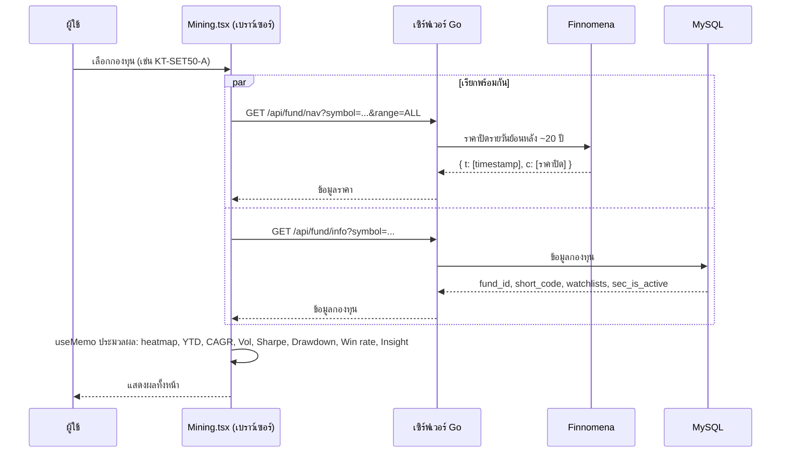

- `range=ALL` ให้ backend ย้อนหลังประมาณ **20 ปี** ซึ่งเป็นการดึงสดจาก Finnomena **ทุกครั้งที่เลือกกองทุน** (1 request/ครั้ง) ดูคำเตือนข้อ 8.2
- ถ้ากองทุนมีข้อมูลสั้น (อายุไม่ถึงหนึ่งปี) ค่าบางส่วนจะไม่น่าเชื่อถือ (ดูข้อจำกัดด้านล่าง)

#### 5.4.2 ส่วนประกอบของหน้า (เรียงจากบนลงล่าง)

| # | ส่วน | แสดงอะไร |
|---|---|---|
| 1 | **แถบหัวกองทุน** | ตัวอักษรแรกของรหัส, ชื่อกองทุน, ดาวเพิ่ม Watchlist (`WatchlistStar`), ปุ่ม "วิเคราะห์เชิงเทคนิค" ไปหน้า `/fund/:symbol`, ป้าย **ปิดกองทุน** (เมื่อ `sec_is_active === false`), ราคาล่าสุด วันที่ และการเปลี่ยนแปลงเทียบวันก่อนหน้า (มูลค่า + %) |
| 2 | **กราฟ YTD แยกตามปี** | เส้น 1 เส้นต่อ 1 ปี ซ้อนกันบนแกน ม.ค.–ธ.ค. แสดงผลตอบแทนสะสมตั้งแต่ต้นปี (%) เส้นของปีล่าสุดหนาเป็นพิเศษ มีเส้นอ้างอิง 0% และ tooltip ตามวันที่ |
| 3 | **ตัวเลือกปี (Legend แบบติ๊กได้)** | ติ๊กเปิด/ปิดเส้นปีใดก็ได้ — มีผลกับ **ตารางรายเดือนและแถวสรุป ▲▼ ด้วย** ไม่ใช่เฉพาะกราฟ |
| 4 | **ตารางผลตอบแทนรายเดือน (Heatmap)** | แถว = ปี (ใหม่→เก่า), คอลัมน์ = 12 เดือน + "รวมทั้งปี", ท้ายตารางมีแถว "ขึ้น และ ลง" นับจำนวนปีที่เดือนนั้น ▲ บวก / ▼ ลบ |
| 5 | **การ์ดตัวชี้วัด 4 ใบ** | CAGR, Max Drawdown, Volatility, Win Rate |
| 6 | **Underwater Chart** | กราฟพื้นที่แสดงระยะห่างจากจุดสูงสุดเดิมตลอดเวลา + ข้อความ "ฟื้นตัวล่าสุดใน N เดือน" หรือ "ยังไม่ฟื้นตัว" |
| 7 | **การกระจายตัวผลตอบแทนรายเดือน** | แผนภูมิแท่งนับจำนวนเดือนในแต่ละช่วงผลตอบแทน |
| 8 | **Quant Insights (กฎอัตโนมัติ)** | คะแนน Quant 0–10, คำอธิบาย 3 ด้าน และ "คำแนะนำตามสถิติ" |

หากยังไม่ได้เลือกกองทุนจะเห็นข้อความแนะนำและตัวอย่างรหัส (KT-SET50-A, K-CHANGE-A, SCBSET) ถ้าโหลดอยู่จะเห็นตัวหมุน ถ้าผิดพลาดจะแสดงข้อความ error สีแดง

#### 5.4.3 สูตรที่ใช้คำนวณ (ตามโค้ดจริง)

กำหนดให้ `t[]` คือเวลา และ `c[]` คือราคาปิดรายวันเรียงตามเวลา

| ค่า | วิธีคำนวณ |
|---|---|
| **ผลตอบแทนรายเดือน** | `(ราคาปิดสิ้นเดือนนี้ − ราคาปิดสิ้นเดือนก่อน) ÷ ราคาปิดสิ้นเดือนก่อน × 100` — สำหรับ **มกราคม** ใช้ราคาปิดสิ้นปีก่อนหน้า ถ้าไม่มี (ปีแรกของข้อมูล) ใช้ราคาแรกของปีนั้นแทน ดังนั้นมกราคมของปีแรกอาจต่ำ/สูงกว่าความจริง |
| **รวมทั้งปี** | `(ราคาปิดสิ้นปี − ราคาปิดสิ้นปีก่อน) ÷ ราคาปิดสิ้นปีก่อน × 100` (ปีแรกใช้ราคาแรกของปีเป็นฐาน, ปีปัจจุบันคือ YTD ถึงข้อมูลล่าสุด) |
| **YTD รายวัน (กราฟเส้น)** | `(ราคาปิดวันนั้น − ราคาปิดสิ้นปีก่อน) ÷ ราคาปิดสิ้นปีก่อน × 100` วางบนแกน 366 วัน (รวม 29 ก.พ.) เส้นจึงมีช่องว่างในวันที่ไม่มีการซื้อขาย และเชื่อมต่อให้ (`connectNulls`) |
| **CAGR** | `((ราคาล่าสุด ÷ ราคาแรก) ^ (1 ÷ ปี) − 1) × 100` โดย `ปี = จำนวนวันที่มีข้อมูล ÷ 252` (นับวันซื้อขาย ไม่ใช่ปฏิทิน) |
| **Volatility (ต่อปี)** | ส่วนเบี่ยงเบนมาตรฐานของผลตอบแทนรายวัน × √252 × 100 |
| **Sharpe** | `CAGR ÷ Volatility` (ไม่หักอัตราดอกเบี้ยปลอดความเสี่ยง) |
| **Max Drawdown** | ค่าติดลบที่ลึกที่สุดของ `(ราคา − จุดสูงสุดสะสม) ÷ จุดสูงสุดสะสม × 100` |
| **เวลาฟื้นตัว** | นับจากวันที่ drawdown ลึกสุด จนราคากลับไปเท่าหรือสูงกว่าจุดสูงสุดก่อนหน้านั้น แปลงเป็นเดือนด้วย `วัน ÷ 30` ปัดเศษ ถ้ายังไม่กลับ = "ยังไม่ฟื้นตัว" ถ้าไม่เคยมี drawdown = ไม่แสดงอะไร |
| **Win Rate** | จำนวนเดือนที่ผลตอบแทน **> 0** ÷ จำนวนเดือนที่มีข้อมูลทั้งหมด × 100 (เดือนที่ได้ 0% พอดีนับเป็นไม่ชนะ) |
| **Underwater Chart** | ใช้ข้อมูล drawdown ทุกๆ 5 จุด (ประมาณรายสัปดาห์) และจุดสุดท้าย เพื่อให้วาดเร็ว |

ช่วงของแผนภูมิการกระจายตัว (ขอบเขตคือ `<` และ `≤` ตามโค้ด):

| ช่วง | เงื่อนไข | สี |
|---|---|---|
| `< -10%` | ผลตอบแทน < −10 | แดงเข้ม |
| `-10% to -5%` | −10 ≤ x ≤ −5 | แดง |
| `-5% to 0%` | −5 < x ≤ 0 | แดงอ่อน |
| `0% to 5%` | 0 < x ≤ 5 | เขียวอ่อน |
| `5% to 10%` | 5 < x ≤ 10 | เขียว |
| `> 10%` | x > 10 | เขียวเข้ม |

สีของช่องในตารางรายเดือนขึ้นกับขนาดผลตอบแทน (เพดาน 15%): **อ่อน** ≤ 30% ของเพดาน (≈ 4.5%), **กลาง** 30–60% (≈ 4.5–9%), **เข้ม** > 60% (> 9%) — เขียว = บวก, แดง = ลบ, ช่องไม่มีข้อมูลแสดง `-`

#### 5.4.4 กฎของ Quant Insights

คะแนน (ใช้สูตรเดียวกับ `cmd/quantsync` ฝั่ง backend จึงตรงกับหน้า Ranking):

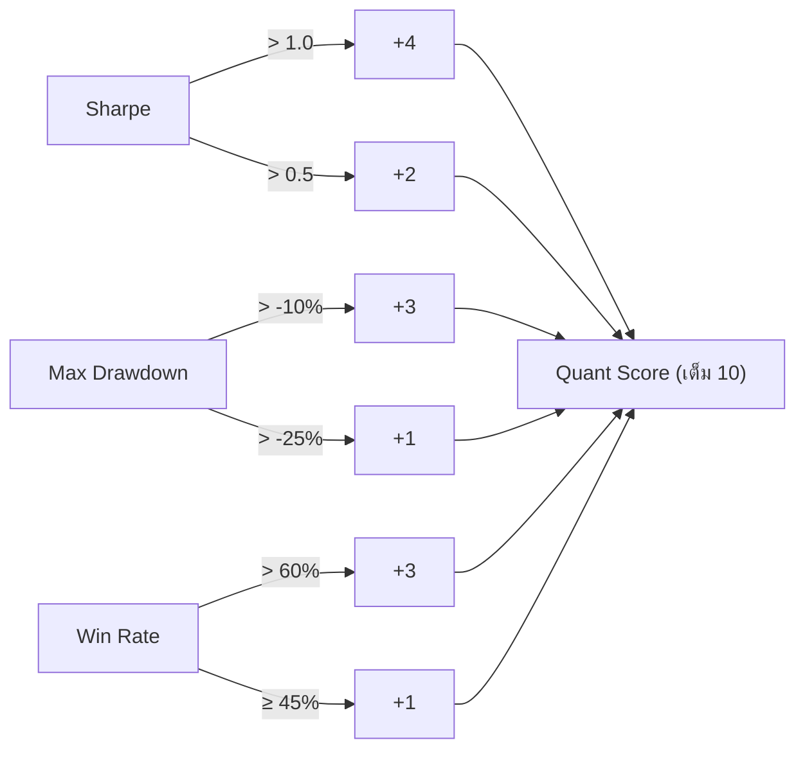

| ด้าน | เงื่อนไข | ข้อความที่แสดง |
|---|---|---|
| **ความคุ้มค่า (Risk/Reward)** อิง Sharpe | > 1.0 | เขียว "ผลตอบแทนคุ้มค่าความเสี่ยงเยี่ยมยอด" |
| | 0.5 – 1.0 | เหลือง "ผลตอบแทนสมเหตุสมผล" |
| | < 0.5 | แดง "ความผันผวนสูงกว่าผลตอบแทน" |
| **ความทนทาน (Drawdown)** | > −10% | เขียว "ความเสี่ยงต่ำ หลับสบาย" |
| | −25% ถึง −10% | เหลือง "ความเสี่ยงปานกลาง" |
| | ≤ −25% | แดง "ความเสี่ยงสูง รถไฟเหาะ" |
| **ความสม่ำเสมอ (Consistency)** อิง Win Rate | > 60% | เขียว "เติบโตอย่างสม่ำเสมอ" |
| | 45% – 60% | เหลือง "สวิงไปมาในกรอบ" |
| | < 45% | แดง "มีความท้าทายสูง" |
| **คำแนะนำตามสถิติ (Playbook)** | Max Drawdown > −25% **และ** Sharpe > 0.5 | **Core Holding** — ใช้เป็นสัดส่วนหลักระยะยาวได้ |
| | อื่นๆ | **Tactical / Satellite** — ไม่ควรเป็นสัดส่วนหลัก เน้นซื้อตอนราคาลงลึก |

แต่ละข้อความแทรกตัวเลขจริงของกองทุน (CAGR, Volatility, Max Drawdown, Win Rate) ไว้ในคำอธิบาย ทั้งหมดเป็น **กฎตายตัว (rule-based)** แม้ป้ายในหน้าจะเขียนว่า "AI Rule-based" ก็ไม่ได้ใช้โมเดล AI ใดๆ

#### 5.4.5 วิธีอ่านผลอย่างถูกต้อง
- **Seasonality ไม่ใช่การพยากรณ์** — "เดือนนี้ในอดีตขึ้นบ่อย" ไม่ได้แปลว่าปีนี้จะขึ้น ดูตัวเลข ▲▼ ท้ายตารางว่ามีกี่ปีที่เก็บตัวอย่าง (ตัวอย่างน้อยไม่น่าเชื่อถือ)
- ปิดเส้นปีที่ผิดปกติ (เช่น ปีวิกฤต) เพื่อดูแนวโน้มปกติได้ ตารางและ ▲▼ จะคำนวณใหม่ตามปีที่เลือกไว้
- ใช้ Max Drawdown + เวลาฟื้นตัว ประกอบการตัดสินใจว่าทนได้หรือไม่ ไม่ใช่ดูแค่ CAGR

#### 5.4.6 ข้อจำกัดที่ควรรู้
- **ใช้ราคาปิดรายวันที่ Finnomena ส่งมาโดยตรง** โค้ดหน้านี้ไม่ได้บวกเงินปันผลกลับเข้าไปเอง สำหรับกองทุนที่จ่ายปันผล ผลตอบแทนรวมจริงอาจต่างจากที่แสดง (ผมไม่ได้ตรวจว่าชุดข้อมูลต้นทางปรับปันผลให้แล้วหรือไม่)
- กองทุนอายุสั้น: CAGR ถูกประมาณด้วยจำนวนวัน ÷ 252 ถ้าข้อมูลสั้นมาก ค่า CAGR/Sharpe อาจเกินจริงหรือไม่เสถียร
- เดือนแรกของข้อมูลและเดือนปัจจุบัน (ยังไม่จบเดือน) ใช้ราคาปิดล่าสุดที่มี จึงอาจไม่ใช่ผลตอบแทนเต็มเดือน และเดือนปัจจุบันถูกนับรวมใน Win Rate
- การเรียก `range=ALL` ดึงข้อมูลสดจาก Finnomena ทุกครั้ง ไม่มีแคชฝั่งเซิร์ฟเวอร์ในเส้นทางนี้
- ข้อสรุป "Core Holding / Tactical" เป็นเพียงกฎสถิติง่ายๆ ไม่ใช่คำแนะนำการลงทุน

---

## 6. ผลลัพธ์ที่ผู้ใช้ได้รับ

| ผู้ใช้ต้องการ | สิ่งที่ได้ |
|---|---|
| "กองทุนไหนน่าสนใจ?" | รายการกองทุนที่ผ่านเงื่อนไขที่ตั้งเอง + อันดับ Quant พร้อมคะแนน 0–10 และตัวเลขกำกับ (CAGR, Drawdown, Sharpe, Win rate) |
| "ตอนนี้ควรซื้อ/รอ?" | ป้ายสัญญาณ 8 แบบ (ซื้อของถูก, ซื้อเต็มสูบ, ทยอยซื้อ, เฝ้าระวัง, ถือ, ทยอยขาย, หลีกเลี่ยง, แพงเกินไป) พร้อมสถานะของแต่ละตัวชี้วัด |
| "ตลาดโดยรวมเป็นอย่างไร?" | อารมณ์ตลาด สัดส่วนกองทุนขึ้น/ลง ค่ามัธยฐานผลตอบแทน/ความผันผวน/Sharpe และ Heatmap รายหมวด |
| "จะกระจายความเสี่ยงอย่างไร?" | รายชื่อกองทุนที่ correlation ติดลบกับกองทุนที่ถืออยู่ |
| "อยากได้เงินปันผล" | ตารางผลตอบแทนปันผล วัน XD และประวัติจ่าย |
| "ไม่อยากเปิดเว็บทุกวัน" | ข้อความสรุปป้ายสัญญาณของรายการเฝ้าดูส่งเข้า Discord วันละครั้ง เรียงตามความน่าสนใจ และไฮไลต์กองทุนที่ป้ายเปลี่ยน |
| "ข้อมูลทางการของกองทุน" | ข้อมูลทะเบียนและ NAV/สินทรัพย์รวมที่ดึงจาก ก.ล.ต. |

ตัวอย่างข้อความ Discord (รูปแบบ): หัวข้อเป็นชื่อรายการเฝ้าดู → แต่ละบรรทัดคือรหัสกองทุน + ป้ายสัญญาณ + RSI ท้ายข้อความมีข้อความ "ข้อมูลประกอบการตัดสินใจ ไม่ใช่คำแนะนำการลงทุน"

---

## 7. แหล่งข้อมูล

| แหล่ง | ใช้ทำอะไร | ที่มาในโค้ด |
|---|---|---|
| **Finnomena** (`https://www.finnomena.com/fn3/api/fund/v2/public`) | รายชื่อกองทุน ผลตอบแทน ความเสี่ยง ค่าธรรมเนียม พอร์ต ปันผล ราคา/NAV ย้อนหลัง (ใช้คำนวณ Quant และตัวชี้วัดทางเทคนิค) | `client.go` |
| **ก.ล.ต. (SEC Open API v2)** | ทะเบียนกองทุนอย่างเป็นทางการ NAV รายวัน สินทรัพย์รวม (AUM) — ต้องมี Subscription Key | `internal/secapi/` |
| **Yahoo Finance** (`query2.finance.yahoo.com`, v8 chart) | ราคาดัชนี ทอง คริปโต สำหรับแถบ ticker และกราฟตลาด (อัปเดตทุก 5 นาที) | `internal/market/` |
| **ip-api.com** | แปลง IP ผู้เข้าชมเป็นประเทศ (ฟีเจอร์ presence) | `internal/api/presence.go` |

Thaiscreener เป็นบริการอิสระ **ไม่มีความเกี่ยวข้อง** กับเจ้าของแหล่งข้อมูลข้างต้น

---

## 8. คำแนะนำและคำเตือน

### 8.1 ด้านการลงทุน
- ระบบนี้เป็น **เครื่องมือประกอบการศึกษา** ไม่ใช่คำแนะนำการลงทุน และไม่ใช่ผู้ให้คำปรึกษาด้านการลงทุนที่ได้รับอนุญาต
- ป้ายสัญญาณ (เช่น "ซื้อเต็มสูบ") คำนวณจากสูตรสถิติของราคาในอดีตเท่านั้น **ผลตอบแทนในอดีตไม่ได้รับประกันผลตอบแทนในอนาคต**
- Quant Score เป็นเกณฑ์ที่ออกแบบเอง (ไม่หักอัตราดอกเบี้ยปลอดความเสี่ยงใน Sharpe) อย่าถือเป็นมาตรฐานเดียวกับผู้จัดอันดับรายอื่น
- ข้อมูลอาจล่าช้าหรือคลาดเคลื่อน ตรวจสอบกับ บลจ. และหนังสือชี้ชวนก่อนตัดสินใจเสมอ

### 8.2 ด้านการดูแลระบบ (สำคัญ)
- **ตั้ง `JWT_SECRET` เสมอ** — ถ้าไม่ตั้ง ระบบใช้ค่าสำรองสำหรับพัฒนา ซึ่งใครก็ปลอม token ได้ ถ้าตั้ง `APP_ENV=production` (หรือ `ENV=production`) แล้วไม่มี `JWT_SECRET` เซิร์ฟเวอร์จะหยุดทำงานทันที
- **ตั้ง `ADMIN_PASSWORD`** (≥ 12 ตัวอักษร) ก่อนรันครั้งแรก ไม่งั้นระบบสุ่มรหัสและพิมพ์ใน log **ครั้งเดียว** (ดูข้อ 12)
- ไฟล์ `.env` และ `settings.json` ไม่ถูกเก็บใน git ห้าม commit ความลับ (DSN, JWT, คีย์ SEC)
- คีย์ SEC เก็บในตาราง `system_settings` (ตั้งในหน้าแอดมิน) ไม่ใช่ใน `.env`
- **ห้าม push ไปยัง remote โดยไม่ตั้งใจ** — การ push เข้า `main` จะ deploy ขึ้นเซิร์ฟเวอร์จริงทันที
- **ระวัง rate limit ของ Finnomena**: worker ใช้ 5 worker พร้อมหน่วงเวลา อย่าเพิ่มจำนวนขนานหรือถี่ขึ้นโดยไม่จำเป็น เพราะอาจถูกบล็อก IP ได้
- Rate limit ของการล็อกอิน (ค่าเริ่มต้น): ล้มเหลว 20 ครั้ง/15 นาที ต่อ IP, 8 ครั้ง/15 นาที ต่อบัญชี, 30 ครั้ง/นาที ต่อ IP, สมัครสมาชิก 10 ครั้ง/ชั่วโมง ต่อ IP — ตัวนับอยู่ใน **หน่วยความจำ** จึงรีเซ็ตเมื่อรีสตาร์ท และใช้ได้กับเซิร์ฟเวอร์เครื่องเดียวเท่านั้น
- ถ้าอยู่หลัง reverse proxy ต้องตรวจให้แน่ใจว่าส่ง IP จริงของผู้ใช้มา มิฉะนั้นการจำกัดต่อ IP จะนับผิด
- ห้าม build ไบนารีไว้ที่รากโปรเจกต์ — ให้อยู่ใน `bin/` เท่านั้น (`.gitignore` ใช้ `/bin/` แบบ anchored)

### 8.3 ข้อจำกัดที่ทราบแล้ว
รายการที่พบแต่ยังไม่ได้แก้ถูกบันทึกไว้ใน [docs/NOTES.md](docs/NOTES.md) เช่น กองทุนบางตัวไม่มี NAV จาก SEC เพราะรหัสไม่ตรงกับการแมป, ข้อมูลกองทุนบางตัวอัปเดตไม่ทัน, และการค้นหา IP ผ่าน ip-api แบบ HTTP ที่มีข้อจำกัดด้านเงื่อนไขการใช้งาน

---

## 9. การติดตั้ง รัน และ Deploy

### 9.1 ความต้องการ
- Go 1.26+ (ไม่ต้องมี C compiler)
- MySQL 5.7+/8.0 หรือ MariaDB 10.11
- Node.js (เฉพาะเมื่อต้องแก้/build frontend)

### 9.2 รันบนเครื่องตัวเอง

```bash
# 1) สร้างฐานข้อมูลเปล่า แล้วตั้งค่า .env ที่รากโปรเจกต์
cat > .env <<'EOF'
PORT=8080
DB_DSN=screener:PASSWORD@tcp(127.0.0.1:3306)/fund_screener?parseTime=true&charset=utf8mb4
JWT_SECRET=ค่าสุ่มยาวๆ
ADMIN_PASSWORD=รหัสผ่านแอดมินอย่างน้อย-12-ตัวอักษร
# SITE_URL=https://thaiscreener.com   # ใช้สร้าง sitemap / canonical (ค่าเริ่มต้นดังนี้)
EOF

# 2) build ทุกโปรแกรมลง bin/
make build

# 3) ดึงข้อมูลชุดแรก (เรียงตามลำดับนี้)
./bin/sync
./bin/quantsync
./bin/techsync

# 4) เริ่มเว็บเซิร์ฟเวอร์ (ต้องรันจากรากโปรเจกต์ เพราะอ่าน frontend/dist และ settings.json แบบ relative)
./bin/screener
# เปิด http://localhost:8080
```

ตัวแปรสภาพแวดล้อมที่ใช้:

| ตัวแปร | จำเป็น | ความหมาย |
|---|---|---|
| `DB_DSN` | ควรมี | สตริงเชื่อม MySQL (ถ้าว่าง เซิร์ฟเวอร์รันได้แต่ไม่มีข้อมูล/ล็อกอิน) |
| `JWT_SECRET` | ใช่ (production) | คีย์เซ็น JWT |
| `ADMIN_PASSWORD` | แนะนำ | รหัสผ่านแอดมินตอนสร้างบัญชี (≥ 12 ตัวอักษร) |
| `PORT` | ไม่ | พอร์ตเซิร์ฟเวอร์ (ค่าเริ่มต้น 8080) |
| `SITE_URL` | ไม่ | ใช้ใน sitemap/SEO (ค่าเริ่มต้น `https://thaiscreener.com`) |
| `APP_ENV` / `ENV` | ไม่ | ตั้งเป็น `production` เพื่อบังคับให้ต้องมี `JWT_SECRET` |
| `WEBHOOK_SECRET`, `DEPLOY_DIR` | เฉพาะ `scripts/webhook` | ตัวรับ webhook deploy ทางเลือกเสริม |

### 9.3 Build Frontend

```bash
cd frontend
npm install
npm run dev      # โหมดพัฒนา
npm run build    # tsc -b && vite build → frontend/dist (ต้อง commit dist ด้วย)
npm run lint
```

### 9.4 Deploy ขึ้นเซิร์ฟเวอร์ aaPanel (อัตโนมัติ)

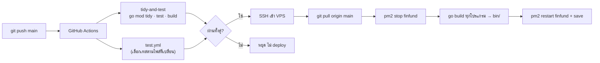

ตั้งค่าครั้งแรก:
1. ใน GitHub Secrets ตั้ง `VPS_HOST`, `VPS_USERNAME`, `VPS_PASSWORD`
2. บนเซิร์ฟเวอร์สร้าง `/www/wwwroot/finfund/.env` (ตามตัวอย่างข้างบน)
3. ลงทะเบียน PM2 ครั้งแรก: `sudo -u www pm2 start ./bin/screener --name finfund`

สคริปต์ deploy ใช้ `set -e` (ผิดพลาดตรงไหนหยุดทันที) และ `git clean -fd frontend/dist` ก่อน pull เพราะ dist ถูก track ใน git รายละเอียดใน [docs/ci-pipeline.md](docs/ci-pipeline.md)

---

## 10. งานเบื้องหลังและการตั้งเวลา (cron)

ตั้งบน aaPanel → Cron → Shell Script (รันจากโฟลเดอร์โปรเจกต์เสมอ เพื่อให้อ่าน `.env` / `settings.json` ชุดเดียวกับเซิร์ฟเวอร์) ตัวอย่างลำดับรายวัน:

```mermaid
gantt
    title ตัวอย่างลำดับงานรายวัน (เวลาเป็นตัวอย่าง ปรับตามจริง)
    dateFormat HH:mm
    axisFormat %H:%M
    section ข้อมูลกองทุน
    sync (ผลตอบแทน/ปันผล)      :a1, 02:00, 40m
    quantsync (Quant Score)     :a2, after a1, 40m
    techsync (MACD/RSI/EMA)     :a3, after a2, 60m
    section ข้อมูล SEC
    navsync (NAV/AUM)           :b1, 04:30, 20m
    section ผู้ใช้
    usersync (นับวัน Premium)   :c1, 00:05, 5m
    section แจ้งเตือน
    signalnotify (Discord)      :d1, 06:30, 15m
```

```bash
cd /www/wwwroot/finfund && ./bin/sync       >> /www/wwwlogs/sync.log 2>&1
cd /www/wwwroot/finfund && ./bin/quantsync  >> /www/wwwlogs/quantsync.log 2>&1
cd /www/wwwroot/finfund && ./bin/techsync   >> /www/wwwlogs/techsync.log 2>&1
cd /www/wwwroot/finfund && ./bin/navsync    >> /www/wwwlogs/navsync.log 2>&1
cd /www/wwwroot/finfund && ./bin/usersync   >> /www/wwwlogs/usersync.log 2>&1
cd /www/wwwroot/finfund && ./bin/signalnotify >> /www/wwwlogs/signalnotify.log 2>&1
```

> `signalnotify` ต้องรัน **หลัง** ข้อมูลราคาอัปเดตแล้ว และ `navsync` ควรรันทุกวัน (ถ้ารันไม่ครบ จะมีช่องว่างของ NAV)
> `market` worker (Yahoo) ไม่ต้องตั้ง cron — เริ่มเองพร้อมเซิร์ฟเวอร์และดึงทุก 5 นาที

---

## 11. สรุปสัญญาณรายวันทาง Discord

ผู้ใช้ตั้งค่าเองในหน้า "ข้อมูลส่วนตัว" (วาง Discord Webhook URL) แล้วเปิดสวิตช์ "แจ้งเตือน Discord" ในแต่ละรายการเฝ้าดูที่ต้องการ ตัวรัน `signalnotify` จะคำนวณป้ายสัญญาณ (ชุดเดียวกับหน้ารายการเฝ้าดู) จากราคา Finnomena ย้อนหลัง 1 ปี แล้วส่งสรุปเข้า Discord ของผู้ใช้แต่ละคนวันละครั้ง

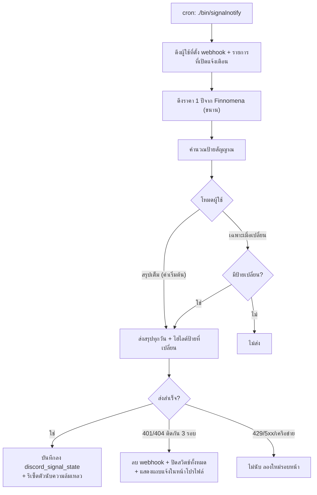

ตั้งเวลาให้รัน **หลังข้อมูลราคาอัปเดตแล้ว**:

```bash
cd /www/wwwroot/finfund && ./bin/signalnotify >> /www/wwwlogs/signalnotify.log 2>&1
```

ทดสอบโดยไม่ส่งจริง (พิมพ์ข้อความออกหน้าจอ) หรือเจาะจงผู้ใช้:

```bash
./bin/signalnotify -dry-run
./bin/signalnotify -dry-run -user <username>
```

รูปแบบการแจ้งเตือน (ผู้ใช้เลือกในหน้า "ข้อมูลส่วนตัว"):

*   **สรุปเต็ม + ไฮไลต์ป้ายที่เปลี่ยน** (ค่าเริ่มต้น): ส่งสรุปทุกวัน และแสดงกองทุนที่ป้ายเปลี่ยนจากครั้งก่อนไว้ด้านบน
*   **เฉพาะเมื่อป้ายเปลี่ยน**: ส่งเมื่อมีการเปลี่ยนแปลงเท่านั้น (ครั้งแรกจะเก็บป้ายเป็นฐานโดยยังไม่ส่ง)

รายละเอียดพฤติกรรม:

*   ระบบเก็บ "ป้ายที่แจ้งไปล่าสุด" ต่อผู้ใช้ต่อกองทุนไว้ในตาราง `discord_signal_state` และอัปเดตเฉพาะหลังส่งสำเร็จ ถ้าส่งไม่ผ่าน การเปลี่ยนแปลงจะไม่หายและจะแจ้งในรอบถัดไป โหมด `-dry-run` ไม่แตะข้อมูลนี้
*   ตัวรันจบด้วย exit code 1 เมื่อส่งให้ผู้ใช้อย่างน้อยหนึ่งคนไม่สำเร็จ เพื่อให้ cron/monitor มองเห็นความล้มเหลว
*   **ส่งสรุปตอนนี้:** ปุ่มในหน้า "ข้อมูลส่วนตัว" ให้ผู้ใช้ส่งสรุปของตัวเองได้ทันที (จำกัด 1 ครั้งต่อ 5 นาทีต่อคน, ไม่เกิน 60 กองทุน, ทั้งระบบทำพร้อมกันไม่เกิน 3 งาน) เป็นสรุปเต็มเสมอ และ **ไม่ขยับ** ฐานป้ายหรือตัวนับความล้มเหลวของรอบรายวัน
*   **ปิด webhook อัตโนมัติ:** ถ้า Discord ตอบว่า webhook ไม่มีอยู่แล้ว (401/404) ติดต่อกัน 3 รอบ (ปรับได้ด้วย `-disable-after N`, `0` = ไม่ปิด) ระบบจะลบ webhook ของผู้ใช้คนนั้น ปิดสวิตช์ทุกรายการ และแสดงแถบแจ้งในหน้า "ข้อมูลส่วนตัว" จนกว่าจะตั้ง webhook ใหม่ กรณีนี้ไม่นับเป็นความล้มเหลว (exit code ไม่เป็น 1) ส่วนข้อผิดพลาดชั่วคราว (429, 5xx, เครือข่าย) ไม่ถูกนับรวม และการส่งสำเร็จจะรีเซ็ตตัวนับ

---

## 12. บัญชีแอดมินและรหัสผ่าน

เซิร์ฟเวอร์ตรวจบัญชี `admin` ทุกครั้งที่เริ่มทำงาน:

*   **ยังไม่มีบัญชี** → สร้างด้วยรหัสผ่านจาก `ADMIN_PASSWORD` ใน `.env` (อย่างน้อย 12 ตัวอักษร) ถ้าไม่ได้ตั้งไว้ ระบบจะสุ่มให้และพิมพ์ใน log **เพียงครั้งเดียว** (`pm2 logs finfund`)
*   **บัญชียังใช้รหัสเดิม `admin123`** (จากเวอร์ชันเก่า) → เปลี่ยนเป็นรหัสใหม่ด้วยวิธีเดียวกัน
*   **ใช้รหัสอื่นอยู่แล้ว** → ไม่แตะต้องเด็ดขาด

เวอร์ชันเก่ารีเซ็ตรหัสผ่านแอดมินเป็น `admin123` ทุกครั้งที่เซิร์ฟเวอร์หรือคำสั่ง `sync` เริ่มทำงาน จึงควรทำตามนี้ก่อน deploy เวอร์ชันนี้:

1.  ตั้ง `ADMIN_PASSWORD=รหัสผ่านที่คาดเดายาก` ใน `.env` บนเซิร์ฟเวอร์ (จะได้ไม่ต้องไปงมหารหัสสุ่มใน log)
2.  เปลี่ยน `JWT_SECRET` เป็นค่าสุ่มใหม่ เพื่อยกเลิกการล็อกอินที่ค้างอยู่ทั้งหมด (token เดิมใช้ได้ถึง 24 ชั่วโมง)
3.  หลัง deploy ตรวจรายชื่อผู้ใช้และค่าตั้งระบบในหน้าแอดมินว่ามีอะไรถูกเปลี่ยนโดยไม่ใช่คุณหรือไม่

ตั้งรหัสผ่านใหม่ภายหลังด้วยคำสั่ง (ผู้ใช้ทั่วไปเปลี่ยนรหัสของตัวเองได้ผ่าน `/api/auth/change-password`):

```bash
cd /www/wwwroot/finfund && ADMIN_NEW_PASSWORD='รหัสผ่านใหม่ของคุณ' ./bin/adminpw
```

ใช้ `-generate` เพื่อให้สุ่มและแสดงให้ครั้งเดียว หรือ `-user ชื่อผู้ใช้` เพื่อตั้งให้ผู้ใช้คนอื่น

---

## 13. การพัฒนา ทดสอบ และ CI/CD

```bash
make build            # build ทุกโปรแกรมลง bin/
make test             # go test -v ./...
go test ./...         # ก่อน commit
go build ./...        # ตรวจว่าคอมไพล์ผ่าน
```

เครื่องมือเสริม (ติดตั้งใน `~/go/bin`): `air` (live-reload), `golangci-lint run ./...`, `staticcheck ./...`, `gofumpt -w .`, `govulncheck ./...`

เทสต์ที่ใช้ฐานข้อมูลจริง (`internal/store/integration_*_test.go`) จะอ่าน `DB_TEST_DSN` — ถ้าไม่ตั้งจะถูกข้าม

```bash
DB_TEST_DSN='user:pass@tcp(127.0.0.1:3306)/test_db?parseTime=true' go test ./internal/store/...
```

CI (`test.yml`) เลือกงานตามไฟล์ที่เปลี่ยน: แก้เฉพาะเอกสาร = ข้ามเทสต์, แก้ frontend = typecheck, แก้โค้ด SQL/API/store = ทดสอบกับ MySQL 5.7, MySQL 8.0 และ MariaDB 10.11 รายละเอียดใน [docs/ci-pipeline.md](docs/ci-pipeline.md)

กติกาโค้ดหลัก: Go แบบ pure (ไม่ใช้ CGO), ห่อ error ด้วย `fmt.Errorf("...: %w", err)`, ผลลัพธ์จาก goroutine/map ต้องเรียงลำดับให้คงที่ (deterministic), ไม่เปลี่ยนอัลกอริทึมการให้คะแนนโดยไม่ได้ตกลงกัน (ดู [AGENTS.md](AGENTS.md) และ [CONTRIBUTING.md](CONTRIBUTING.md))

---

## 14. เอกสารอื่นในโปรเจกต์

| ไฟล์ | เนื้อหา |
|---|---|
| [docs/API.md](docs/API.md) | Finnomena API และวิธีใช้ client |
| [docs/ci-pipeline.md](docs/ci-pipeline.md) | รูปแบบ GitHub Actions และข้อควรระวัง |
| [docs/sec_api_v2_usage.md](docs/sec_api_v2_usage.md), [docs/sec_api_v2_mapping.md](docs/sec_api_v2_mapping.md), [docs/sec_fund_api_v2.md](docs/sec_fund_api_v2.md) | การใช้งานและการแมปข้อมูล SEC API v2 |
| [docs/sec-first-migration-plan.md](docs/sec-first-migration-plan.md) | แผนย้ายมาใช้ SEC เป็นแหล่งหลัก |
| [docs/plan-fund-screener.md](docs/plan-fund-screener.md), [PLAN1.md](PLAN1.md) | แผนพัฒนา |
| [docs/NOTES.md](docs/NOTES.md) | ที่พักข้อสังเกต/ปัญหาที่ยังไม่ได้แก้ |
| [CHANGELOG.md](CHANGELOG.md) | ประวัติการเปลี่ยนแปลง (ยังเป็นของไลบรารี finnomena-go เดิม) |

---

## 15. ติดต่อเรา

| ช่องทาง | รายละเอียด |
|---|---|
| 🌐 เว็บไซต์ | <https://thaiscreener.com> |
| 📧 อีเมล | [contact@thaiscreener.com](mailto:contact@thaiscreener.com) |

ติดต่อเรื่อง: ข้อมูลกองทุนผิดพลาด, ข้อเสนอแนะ/แจ้งบั๊ก, ปัญหาการเข้าสู่ระบบหรือการแจ้งเตือน Discord และการขอใช้สิทธิ์เกี่ยวกับข้อมูลส่วนบุคคล

เมื่อแจ้งปัญหา ช่วยระบุ: รหัสกองทุน, หน้าที่พบปัญหา (URL), เวลาที่เกิด และภาพหน้าจอ (ถ้ามี) — **ห้ามส่งรหัสผ่าน, JWT, Discord Webhook URL หรือคีย์ SEC ทางอีเมล**

---

ใบอนุญาต: ดูไฟล์ [LICENSE](LICENSE)
